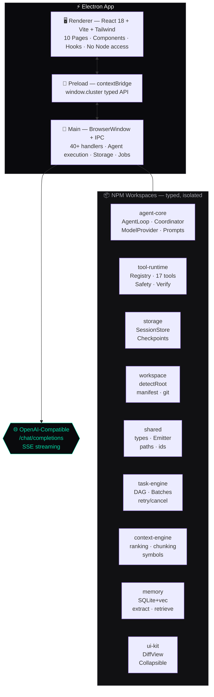
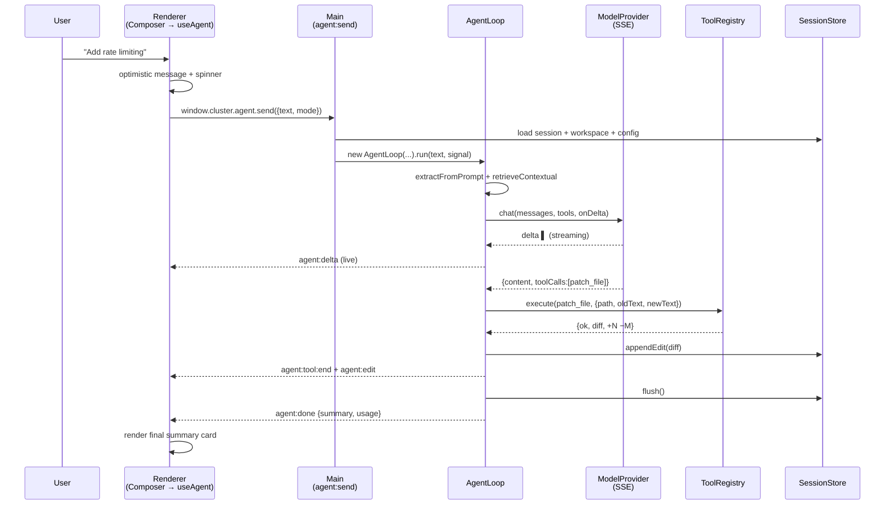

<div align="center">

<!-- ═══════════════════════════════════════════════════════════════════ -->
<!--  HERO BANNER                                                        -->
<!-- ═══════════════════════════════════════════════════════════════════ -->


### The Desktop AI That *Actually* Codes With You

**Multi-agent orchestration · Persistent memory · Live diffs · Instant rollback**
**A premium, dark, native desktop — not a terminal, not a browser tab.**

<br/>

<!-- Badges Row 1 — Build & Stack -->
[](https://www.typescriptlang.org/)
[](https://www.electronjs.org/)
[](https://react.dev/)
[](https://vitejs.dev/)
[](https://tailwindcss.com/)
[](https://nodejs.org/)

<!-- Badges Row 2 — Quality -->
[](#)
[](#license)
[](#)
[](#)

<br/>

**[📚 Documentation](./documentation/)** · **[🏗 Architecture](./documentation/architecture/system.md)** · **[⚡ Quick Start](#-quick-start)** · **[🔧 Troubleshooting](./documentation/troubleshooting/troubleshooting.md)**

</div>

---

<div align="center">

```sh
git clone <repo> && cd Cluster && npm install && npm run electron:dev
# → Cluster opens. Press 2 for Workspace. Type anything. Watch it build.
```

</div>

---

## ✨ Why Cluster Exists

> Most AI coding tools live in a browser tab or a terminal. They forget your project the moment you close them, they can't show you what they changed until it's too late, and they vanish when a long build is still running.
>
> **Cluster fixes all three.**

<table>
<tr>
<td width="33%" align="center">

### 🧠 Remembers
**Project-aware memory** that survives restarts. Goals, preferences, architecture decisions and bug-fix lessons are extracted automatically and injected into every future prompt.

</td>
<td width="33%" align="center">

### 🛡️ Protects
**Every edit is auditable.** Backups before writes, unified diffs with `+18 −3` counts, full snapshots with `git HEAD`, one-key `Ctrl+G` checkpoint and instant rollback.

</td>
<td width="33%" align="center">

### ⚙️ Orchestrates
**Real multi-agent team.** Planner → Coder → Reviewer → Tester run in parallel DAG batches with file locks, not a single chat loop pretending to be a team.

</td>
</tr>
</table>

---

## 🖥️ Preview

<div align="center">

| Workspace — where you talk to Cluster | Tasks — the plan as a living DAG |
|:---:|:---:|
|  |  |

| Diffs — every edit, reviewable | Memory — project knowledge that persists |
|:---:|:---:|
|  |  |

*Replace placeholders with real screenshots: `apps/electron/resources/screenshots/` → commit and they render automatically.*

<details>
<summary>📸 How to capture screenshots</summary>

```powershell
npm run electron:dev          # launch dev build
# open each page (1 → 0), capture with Win+Shift+S or macOS Cmd+Shift+4
# save to apps/electron/resources/screenshots/{workspace,tasks,diffs,memory}.png
```

</details>

</div>

---

## 🧩 At a Glance

<div align="center">

|  &nbsp;  |  Metric  |  Value  |
|:---:|:---|:---|
| 🤖 | **Specialized agents** | Planner · Coder · Reviewer · Tester · Context · Coordinator |
| 🧰 | **Tools** | 17 — read / write / search / git / exec / verify / checkpoint / diff-review |
| 🖥️ | **Pages** | 10 dedicated views + global Command Palette (`Ctrl+K`) |
| ⚡ | **Parallelism** | Up to 4 concurrent tasks, dependency-ordered batches, file locks |
| 🧠 | **Memory** | SQLite + sqlite-vec · category-aware hybrid retrieval · auto-extraction |
| 🔒 | **Safety** | Zod validation · risk tiers (`safe`/`caution`/`destructive`) · auto-backups · snapshots |
| 🎨 | **UI** | `#07070a` · Tailwind · Inter + JetBrains Mono · 36px top-bar · 64-wide sidebar |
| 📦 | **Ship** | `electron-builder` → `Cluster-Setup-0.1.0.exe` (NSIS, x64) + macOS dmg + Linux AppImage |

</div>

---

## 🎯 Feature Map

### 1 · Multi-Agent Orchestration

<table>
<tr>
<td>

**You describe the goal. Cluster decomposes it.**

```
"Add auth middleware with rate limiting and tests"
        │
        ▼
  ┌─ Context ─┐  gathers file groups, recent git changes
  └─────┬─────┘
        ▼
  ┌─ Planner ─┐  builds DAG: 7 tasks, 3 batches, roles assigned
  └─────┬─────┘
        ▼
  Batch 1 ▶  [ Coder: auth.ts ]  [ Coder: rateLimit.ts ]  (parallel)
  Batch 2 ▶  [ Reviewer: inspect both ]                  (after Batch 1)
  Batch 3 ▶  [ Tester: vitest run ]                      (after Batch 2)
```

*Each agent only sees its allowed tools. Coders can't run commands. Testers can't edit files. File locks prevent conflicts.*

</td>
<td width="36%">

| Role | Tools | Parallel | Max |
|:---|:---|:---:|:---:|
| **Planner** | read-only | ✗ | 1 |
| **Context** | read-only | ✓ | 2 |
| **Coder** | read + write | ✓ | 3 |
| **Reviewer** | read-only | ✓ | 2 |
| **Tester** | read + exec | ✓ | 2 |
| **Coordinator** | all | ✗ | 1 |

Checkpoint auto-created before every Coder task.

</td>
</tr>
</table>

### 2 · Safe, Auditable Edits

| Layer | What happens | Where |
|:---|:---|:---|
| **Validate** | Zod schema rejects bad input — never touches disk | `ToolRegistry.execute()` |
| **Classify** | `safe` → green · `caution` → amber · `destructive` → red + confirmation modal | `safety.ts` |
| **Backup** | Pre-edit snapshot | `~/.cluster/backups/<session>/<call>/…` |
| **Diff** | Unified diff + `+N −M` counts, hunk headers | Diff & Review page |
| **Snapshot** | Full checkpoint (`git ls-files` + `git HEAD`) | `~/.cluster/checkpoints/<session>/<id>/` |
| **Rollback** | One click restores any snapshot | `Ctrl+G` or Checkpoints page |

### 3 · Persistent Memory

<div align="center">

```
  Prompt ──► Extraction (regex) ──┐
                                  ▼
                           ┌─────────────┐      ┌──────────────────┐
                           │  SQLite +   │─────►│ Hybrid Retrieval │
  Workflow ──► Extraction ─►│  sqlite-vec  │      │  50% similarity  │
  (task done)              │  (+ JSON fb) │      │  20% importance  │
                           └─────────────┘      │  + pin bonus     │
                                                │  + context bonus │
                                                └────────┬─────────┘
                                                         │
                                                         ▼
                                              ┌─────────────────────┐
                                              │  Injected into      │
                                              │  next system prompt │
                                              └─────────────────────┘
```

*Categories: `project` · `ui_style` · `user_preference` · `architecture` · `workflow` · `task` · `bug` · `file` · `command` — with pin/archive, search, and cross-session recall.*

</div>

### 4 · Live Everything

| Stream | Source | UI |
|:---|:---|:---|
| **Token streaming** | `ModelProvider` SSE `delta.content` | Workspace — typewriter with `▌` cursor |
| **Tool output** | `run_command` `tool:output` chunks | Logs + Background pages, live |
| **Progress** | `AgentLoop` · `Coordinator` `[role] message` | Logs activity feed (200-line cap) |
| **State** | `planning` → `thinking` → `reading`/`editing`/`running` → `done` | Top bar + Sidebar footer + Status bar |

---

## 🏗️ Architecture

### Process Model



<details>
<summary>📐 Text fallback (if Mermaid doesn't render)</summary>

```
Renderer (React, no Node)  ──window.cluster (contextBridge)──►  Main (BrowserWindow)
                                                                  │
                          ┌───────────────────────────────────────┼────────────────────┐
                          │  agent-core │ tool-runtime │ storage │ workspace │ shared │
                          │  task-engine│ context-engine│ memory │ ui-kit    │        │
                          └───────────────────────────────────────┴────────────────────┘
                                                                  │
                                                                  ▼
                                                        OpenAI-Compatible API
                                                         /chat/completions (SSE)
```

</details>

### Module Responsibilities

| Package | Owns | Key exports |
|:---|:---|:---|
| **`@cluster/agent-core`** | LLM, loop, coordinator, prompts, config | `AgentLoop` · `Coordinator` · `ModelProvider` · `loadConfig` |
| **`@cluster/tool-runtime`** | Registry, validation, execution, safety | `ToolRegistry` · `createDefaultRegistry` · 17 tools · `riskOf` |
| **`@cluster/storage`** | Sessions (lowdb), checkpoints, backups | `SessionStore` · `createCheckpoint` · `rollbackToCheckpoint` |
| **`@cluster/workspace`** | Project detection, manifest, git, watch | `detectProjectRoot` · `loadWorkspaceInfo` · `languageForPath` |
| **`@cluster/shared`** | Types, events, ids, paths — no business logic | `Session` · `TaskGraph` · `Emitter` · `AGENT_DEFINITIONS` |
| **`@cluster/task-engine`** | DAG, batch-parallel executor, retry | `TaskEngine` · `TaskGraphStore` · `TaskPlanner` |
| **`@cluster/context-engine`** | Repo intelligence, ranking, chunking, symbols | `ContextEngine` · `rankFiles` · `chunkFile` |
| **`@cluster/memory`** | SQLite+vec store, extraction, retrieval | `MemoryStore` · `MemoryDatabase` · `MemoryExtractor` |
| **`@cluster/ui-kit`** | Reusable React primitives | `DiffView` · `Collapsible` · `SplitPane` · `TaskItem` |

Dependency order: `shared → workspace → storage → tool-runtime → memory → context-engine → task-engine → agent-core → electron`

### IPC — the only bridge

*Every* renderer action crosses `contextBridge`. No `fs`, no `child_process`, no API key in the renderer.

| Call style | Example | Direction |
|:---|:---|:---|
| **invoke** (request/response) | `sessions:list` · `tools:execute` · `checkpoints:rollback` | Renderer → Main → Renderer |
| **on** (push stream) | `agent:message` · `agent:delta` · `agent:tool:output` · `agent:done` | Main → Renderer (14 channels) |

Full surface documented in [`documentation/ui/hooks.md`](./documentation/ui/hooks.md#ipc-api-surface-windowcluster).

### Data Flow (one message, end-to-end)



---

## 🧭 The 10 Pages

<div align="center">

| # | Page | Shortcut | What you do there |
|:---:|:---|:---:|:---|
| ◈ | **Sessions** | `1` | List · search · filter · switch · rename · delete · stats |
| 💬 | **Workspace** | `2` | Chat · streaming · tool cards · plan · confirm modals · composer |
| 🗂️ | **Tasks & Plan** | `3` | DAG · batches · role groups · progress · dependency levels |
| 🔍 | **Diffs & Review** | `4` | Unified diffs · `+N −M` · hunk colors · rollback |
| 📜 | **Logs** | `5` | Activity feed (200 cap) · live `tool:output` · search & filter |
| ⚙️ | **Background** | `6` | PID · command · port auto-detect · health · start/stop/restart |
| 📸 | **Checkpoints** | `7` | Timeline · file list · `git HEAD` · one-click restore |
| 🧠 | **Memory** | `8` | Project vs session · categories · pin/archive · manual add |
| 🔌 | **Provider** | `9` | baseUrl · key (masked) · model discovery · live ping |
| 🛠️ | **Settings** | `0` | Workspace switcher (`Ctrl+O`) · git · diagnostics |
| ⌘ | **Palette** | `Ctrl+K` | Navigation + actions + recent workspaces + recent sessions |

*Every page is keyboard-navigable. No mouse required.*

</div>

---

## ⚡ Quick Start

### Prerequisites

| Requirement | Minimum | Check |
|:---|:---|:---|
| **Node.js** | `>= 20.10.0` | `node -v` |
| **npm** | bundled | `npm -v` |
| **Git** | any | `git --version` |

### 1 — Install

```bash
git clone <repo-url>
cd Cluster
npm install          # workspaces auto-linked
npm run typecheck    # should print nothing → all good
npm test             # 85 tests · 8 files · ~2s
```

### 2 — Configure

Cluster resolves config in **4 layers** — later layers win:

```
defaults  →  env (.env)  →  ~/.cluster/config.json  →  ./cluster.config.json
```

**Pick one:**

<table>
<tr>
<td width="33%">

**Env file** *(dev)*

```bash
cp .env.example .env
# edit:
# CLUSTER_API_KEY=sk-...
# CLUSTER_BASE_URL=https://api.openai.com/v1
# CLUSTER_MODEL=gpt-4o-mini
```

</td>
<td width="33%">

**In-app** *(easiest)*

```
Open Cluster → press 9
→ Provider page
→ paste Base URL + API Key
→ Test Connection ✓
```

</td>
<td width="33%">

**Config file** *(per-project)*

```jsonc
// cluster.config.json
{
  "model": "gpt-4o",
  "temperature": 0.1,
  "commands": {
    "build": "npm run build",
    "test": "npm test --silent"
  }
}
```

</td>
</tr>
</table>

### 3 — Run

| Command | What it does |
|:---|:---|
| `npm run electron:dev` | **Dev:** Vite@5173 + tsc watch + Electron (DevTools auto-open) |
| `npm run electron:build` | **Build:** `tsc` (main+preload) + `vite build` → `apps/electron/dist/` |
| `npm run electron:package` | **Ship:** `electron-builder --win --x64` → `release/Cluster-Setup-0.1.0.exe` |
| `npm test` | Vitest, 85 tests |

> **First launch?** The window tries `http://localhost:5173` (15 × 500 ms). If Vite isn't ready, it falls back to the built `dist/renderer/index.html` — never a black screen.

---

## 🔩 Configuration Reference

<details>
<summary><strong>Click to expand — all env vars, defaults, and file schema</strong></summary>

### Environment variables

| Variable | Default | Description |
|:---|:---|:---|
| `CLUSTER_API_KEY` | — | LLM API key (fallback: `OPENAI_API_KEY`) |
| `CLUSTER_BASE_URL` | `https://api.openai.com/v1` | Chat completions base (fallback: `OPENAI_BASE_URL`) |
| `CLUSTER_MODEL` | `gpt-4o-mini` | Model name |
| `CLUSTER_TOOL_MODE` | `auto` | `auto` → try native, fallback to text · `native` → always JSON tools · `text` → fenced-block tools |
| `CLUSTER_MAX_ITERATIONS` | `40` | Max agent loop iterations |
| `CLUSTER_COMMAND_TIMEOUT_MS` | `120000` | Shell command timeout |
| `CLUSTER_TEMPERATURE` | `0.2` | Sampling temperature (0–2) |
| `CLUSTER_CONFIRM_DESTRUCTIVE` | `true` | Confirm `destructive` tools before running |
| `CLUSTER_CONFIRM_COMMANDS` | `false` | Paranoid: confirm *every* shell command |
| `CLUSTER_HOME` | `~/.cluster/` | Override all storage paths |

### Config file schema (`~/.cluster/config.json` or `cluster.config.json`)

```jsonc
{
  "model": "gpt-4o",
  "baseUrl": "https://api.openai.com/v1",
  "apiKey": "sk-...",                 // stored plaintext — prefer env in shared machines
  "temperature": 0.2,
  "maxIterations": 40,
  "confirmDestructive": true,
  "commands": {
    "build": "npm run build",
    "test": "npm test",
    "lint": "eslint .",
    "format": "prettier --write ."
  },
  "ignore": ["dist/**", "node_modules/**"]
}
```

### Storage layout (`CLUSTER_HOME`)

```
~/.cluster/
├── sessions.json                 lowdb JSON — every session
├── sessions.json.corrupt-*       quarantined on parse failure (never deleted)
├── cluster_memory.db             SQLite + sqlite-vec (native) — or .json fallback
├── cluster_memory.db.json        JSON dump for Electron / non-native runtimes
├── backups/<session>/<call>/…    pre-edit file copies
├── checkpoints/<session>/<id>/   meta.json + file snapshots
└── patch-history/<session>/…     patch operation log
```

</details>

---

## 🧰 Tool Reference

<div align="center">

*All tools are Zod-validated. Invalid input never reaches the filesystem. Every call is risk-rated and, when needed, confirmation-gated.*

</div>

| Tool | Category | Risk | What it does |
|:---|:---|:---:|:---|
| `workspace_info` | Reading | 🟢 safe | Project kind/pm, git branch, languages, suggested commands |
| `list_files` | Reading | 🟢 safe | Glob file listing |
| `read_file` | Reading | 🟢 safe | Text file (binary guard + line-range) |
| `search_text` | Reading | 🟢 safe | Literal / regex search across project |
| `git_status` | Git | 🟢 safe | Branch, dirty, staged/unstaged/untracked |
| `git_diff` | Git | 🟢 safe | Unified diff of working tree |
| `write_file` | Writing | 🟡 varies | Create/overwrite (auto-backup + diff) |
| `patch_file` | Writing | 🟡 varies | Surgical find→replace (preferred) |
| `run_command` | Exec | 🔴 varies | Shell with live `tool:output` streaming, cancellable |
| `verify` | Verify | 🟡 caution | Auto-discovers build/test/lint and runs them |
| `discover_tests` | Verify | 🟢 safe | Lists test files & suggested commands |
| `checkpoint_create` | Safety | 🟢 safe | Snapshot (`git ls-files` + `HEAD`) |
| `checkpoint_list` | Safety | 🟢 safe | List checkpoints for a session |
| `checkpoint_rollback` | Safety | 🔴 destructive | Restore files from a snapshot |
| `diff_preview` | Review | 🟢 safe | Preview diff before applying |
| `apply_hunks` | Review | 🟡 caution | Apply selected hunks only |
| `patch_history` | Review | 🟢 safe | Patch operation history |

**Safety net (every tool call):** `resolveWithin()` path-escape guard · binary detection · 120k history budget · 24k tool-output cap · 3× repetition stall detection · `confirm()` gate for `destructive`.

---

## ⌨️ Keyboard

<div align="center">

| Shortcut | Action |  | Shortcut | Action |
|:---:|:---|:---:|:---:|
| `Ctrl+K` | Command palette | | `1` – `0` | Jump to page |
| `Ctrl+O` | Open workspace folder | | `Enter` | Send message |
| `Ctrl+G` | Snapshot checkpoint | | `Shift+Enter` | Newline |
| `Ctrl+C` | Cancel running agent | | `Esc` | Close modal / decline |

*All shortcuts work globally except `1`–`0` which are suppressed while typing in an input.*

</div>

### Slash commands (in Workspace composer)

```
/help /clear /sessions /workspace /tasks /plan /diff /logs
/background /jobs /checkpoints /checkpoint /memory /provider /model /settings
/multi <request>   → force multi-agent mode for this message
```

---

## 🗂️ Project Structure

```
Cluster/
├── apps/
│   └── electron/                 Electron desktop — the product
│       ├── src/main/index.ts     BrowserWindow, 40+ IPC handlers, agent wiring, jobs
│       ├── src/preload/index.ts  contextBridge → window.cluster (typed IpcApi)
│       ├── src/renderer/
│       │   ├── App.tsx           Sidebar + TopBar + 10 pages + StatusBar + Palette
│       │   ├── components/       Sidebar, TopBar, Composer, DiffViewer, Palette…
│       │   ├── hooks/            useAgent (14 events → state) · useSessions
│       │   ├── pages/            Sessions · Workspace · Tasks · Diff · Logs
│       │   │                     Background · Checkpoints · Memory · Provider · Settings
│       │   └── styles/global.css grid-bg, scrollbars, glows
│       ├── vite.config.ts · tailwind.config.js · postcss.config.js
│       └── package.json          build + electron-builder (nsis → .exe, dmg, AppImage)
│
├── packages/
│   ├── agent-core/               provider, AgentLoop, Coordinator, agents/*, config, prompts
│   ├── tool-runtime/             ToolRegistry + 17 tools + safety/permissions/verification
│   ├── workspace/                detectProjectRoot, loadWorkspaceInfo, git, watch, manifest
│   ├── storage/                  SessionStore (lowdb), checkpoints, backups, patchHistory
│   ├── shared/                   types (Session/Message/ToolCall/TaskGraph…), Emitter, paths
│   ├── task-engine/              TaskGraphStore (DAG) + TaskEngine (batches, concurrency, retry)
│   ├── context-engine/           repoIntelligence, ranking, chunking, symbols
│   ├── memory/                   MemoryStore (project vs session), SQLite+vec, extract/retrieve
│   └── ui-kit/                   DiffView, Collapsible, SplitPane, TaskItem
│
├── documentation/                ← Full docs (you are here in spirit)
│   ├── README.md                 Index + status
│   ├── overview.md               Product summary & direction
│   ├── architecture/             system · packages · data-flow
│   ├── workflow/                 execution-flow · agent-loop · multi-agent
│   ├── reference/                data-model · task-graph
│   ├── memory/ · provider/ · tools/ · checkpoints/ · context/
│   ├── ui/                       pages · components · hooks
│   ├── operations/               background-jobs
│   ├── build/                    packaging
│   ├── configuration/            config (4-layer resolution)
│   ├── guide/                    quick-start · developer-guide · contribution-guide
│   └── troubleshooting/          troubleshooting
│
├── scripts/phase2-smoke.mjs
├── tsconfig.base.json / tsconfig.json   project references (all packages + electron)
└── package.json                         workspaces + scripts
```

---

## 🛠️ Development

```bash
npm run typecheck          # tsc -b (no emit) — must be clean before PR
npm run build              # tsc -b → all dist/
npm run rebuild            # tsc -b --force
npm test                   # vitest run — 85 tests
npm run test:watch         # vitest watch

# Electron
npm run electron:dev       # vite@5173 + tsc --watch + electron (DevTools detached)
npm run electron:build     # tsc (main+preload) + vite build → apps/electron/dist/
npm run electron:package   # + electron-builder --win --x64 → release/Cluster-Setup-*.exe
```

**Stack:** TypeScript 5.7 (project references) · React 18 · Vite 5 · Tailwind 3 · Electron 31 · lowdb · zod · fast-glob · chokidar · execa

---

## 🗺️ Roadmap

| Now (0.1) | Next | Later |
|:---|:---|:---|
| Single + multi-agent loops | Real embeddings (replace synthetic vectors) | Collaborative sessions |
| 17 tools + safety tiers | Cross-provider SDKs (Anthropic, Google) | Web deployment |
| Checkpoints + rollback | Plugin API for custom tools | Session sharing & export |
| SQLite+vec memory | Incremental context-engine updates | Cloud sync (opt-in) |

---

## 📚 Documentation

<div align="center">

*Every doc reflects the real codebase — no aspirational fiction.*

</div>

| Doc | What you'll learn |
|:---|:---|
| [**Overview**](./documentation/overview.md) | Product summary, feature map, direction |
| [**System Architecture**](./documentation/architecture/system.md) | Process model, module responsibilities, IPC |
| [**Package Map**](./documentation/architecture/packages.md) | Every package, every file, dependency graph |
| [**Data Flow**](./documentation/architecture/data-flow.md) | Event bus, layer-by-layer trace, state model |
| [**Execution Flow**](./documentation/workflow/execution-flow.md) | App launch → session → planning → tools → done |
| [**Agent Loop**](./documentation/workflow/agent-loop.md) | `AgentLoop.run()` step-by-step, stall detection |
| [**Multi-Agent**](./documentation/workflow/multi-agent.md) | Coordinator, TaskEngine, roles, file locks |
| [**Data Models**](./documentation/reference/data-model.md) | Session, Message, ToolCall, Edit, Plan, Workspace |
| [**Task Graph**](./documentation/reference/task-graph.md) | DAG types, batches, topological sort |
| [**Memory System**](./documentation/memory/memory-system.md) | SQLite+vec, extraction, hybrid retrieval |
| [**Provider System**](./documentation/provider/provider-system.md) | Config layers, streaming, text-protocol fallback |
| [**Tools**](./documentation/tools/tool-runtime.md) | All 17 tools — inputs, outputs, risk |
| [**Checkpoints**](./documentation/checkpoints/checkpoints.md) | Snapshots, rollback, risk assessment |
| [**Context Engine**](./documentation/context/context-engine.md) | Ranking, chunking, symbols |
| [**Pages**](./documentation/ui/pages.md) | All 10 pages — layout, data sources |
| [**Components**](./documentation/ui/components.md) | ui-kit + renderer components |
| [**Hooks & IPC**](./documentation/ui/hooks.md) | `useAgent`, `useSessions`, full `window.cluster` API |
| [**Background Jobs**](./documentation/operations/background-jobs.md) | Lifecycle, port detection, streaming |
| [**Packaging**](./documentation/build/packaging.md) | Dev/build/package, platform targets |
| [**Configuration**](./documentation/configuration/config.md) | 4-layer resolution, env vars, storage paths |
| [**Quick Start**](./documentation/guide/quick-start.md) | Install, configure, run |
| [**Developer Guide**](./documentation/guide/developer-guide.md) | Add a page / agent / tool / provider / IPC |
| [**Troubleshooting**](./documentation/troubleshooting/troubleshooting.md) | Startup, build, provider, storage, memory, UI |
| [**Contribution Guide**](./documentation/guide/contribution-guide.md) | Conventions, structure, testing, style, PR checklist |

---

## 🤝 Contributing

We welcome contributions — **read [`documentation/guide/contribution-guide.md`](./documentation/guide/contribution-guide.md) first.**

Quick checklist for every PR:

- [ ] `npm run typecheck` — zero errors
- [ ] `npm test` — all 85 tests green
- [ ] No `console.log` in production paths · no hardcoded paths · `AbortSignal` propagated
- [ ] Follows Conventional Commits (`feat(agent): …` · `fix(storage): …`)
- [ ] Docs updated if you touched architecture, tools, or IPC

---

## 📄 License

MIT — see [LICENSE](./LICENSE) if present, otherwise [opensource.org/licenses/MIT](https://opensource.org/licenses/MIT).

---

<div align="center">

**Built with ◈ by the Cluster team.**

*If Cluster helped you ship something, star the repo — it helps more than you think.*

</div>
